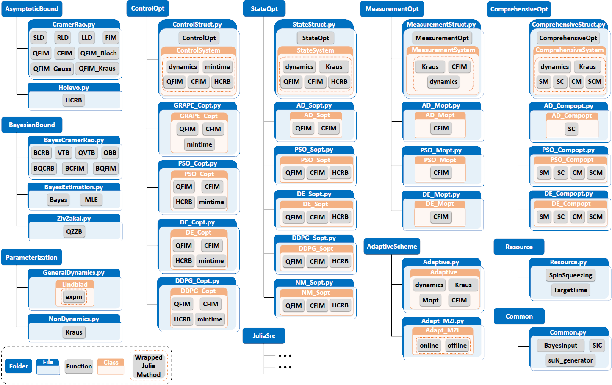

# **Welcome to the QuanEstimation**
QuanEstimation is a Python-Julia based open-source toolkit for quantum parameter estimation
which covers the calculation of quantum metrological tools, the optimization of probe state,
control, and measurement in quantum metrology. Futhermore, QuanEstimation can also perform
comprehensive optimization of probe state, control, and measurement to generate optimal 
quantum parameter estimation schemes, and generate adaptive measurement schemes.

<figure markdown>
  { width="800" }
  <figcaption>The package structure of QuanEstimation. The blue boxes,  white boxes with blue 
  edges, orange boxes and gray boxes are folders, files, classes and functions in Python. 
  The gray boxes with dotted orange boundaries represents the functions that solved in Julia.
  </figcaption>
</figure>

The package contains several well-used metrological tools, such as quantum (classical) 
Cramér-Rao bounds, Hevolo Cramér-Rao bound and Bayesian versions of quantum (classical) 
Cramér-Rao bounds, quantum Ziv-Zakai bound, and Bayesian estimation. The users can use these
bounds as the objective functions to optimize probe state, control, measurement, and 
simultaneous optimizations among them. The optimization methods include the gradient-based 
algorithms such as the gradient ascent pulse engineering (GRAPE), GRAPE algorithm based on the 
automatic differentiation (auto-GRAPE), automatic differentiation (AD) etc., and the 
gradient-free algorithms such as particle swarm optimization (PSO), differential evolution (DE), 
deep deterministic policy gradients (DDPG) etc..

The interface of QuanEstimation is written in Python, but the most calculation processes are
executed in Julia for the computational efficiency. Therefore, in addition to the Python-Julia
version, QuanEstimation also has a Julia version. 

---